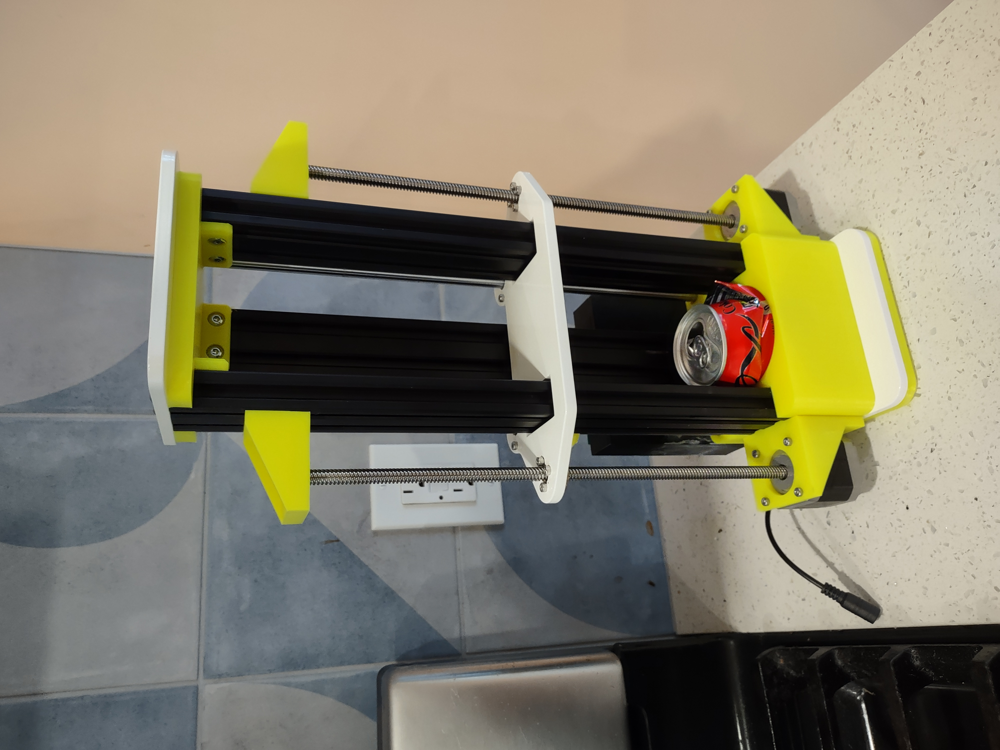
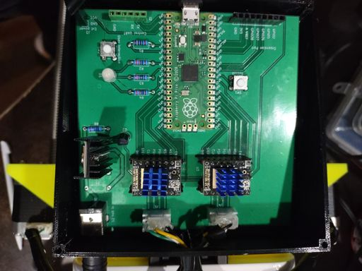
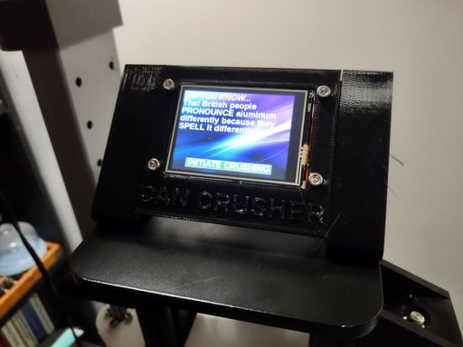
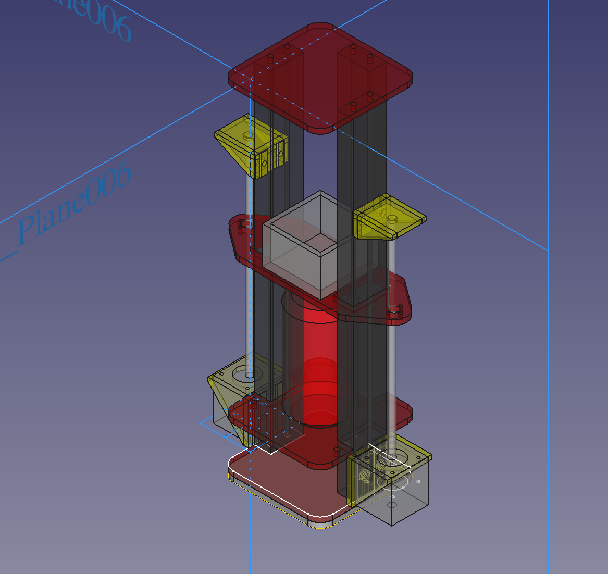

Welcome to the repository for the most sophisticated robotic aluminum
can crusher that the world has seen!

This is the result of a hobby project that combines CAD design,
Hardware, PCB design, firmware, and software to build an over-the-top
computer-controlled can crusher. I wanted to use a wide variety of skills
on this project instead of going deep into a specific skill.

## The Frame

The frame starts with 3 standard 2040 slotted aluminum extrusions. From there
the major structural elements, the:

* top
* bottom
* crusher plate

Are made from laser cut aluminum.

The rest of the parts are 3D printed.

All design elements are in the included FreeCAD workspace. If you just
want to cut or print the parts refer to the [stl directory](./stl) for
3D print files or the [step directory](./step) for files suitable for laser
cutting.

You will also need two stepper motors with rods and two smooth rods to
assemble the frame in its entirety.

## Stepper Control Board

To drive the stepper motors I've made a control board powered by a Raspberry
Pi Pico that uses TMC2209 chips to drive the steppers. This allows me to
auto-detect limits of movement.

The design is in KiCad. Gerber files are also included in the repo for
getting PCBs made.

At a high level the control board:

* Initializes the system
* Accepts a small command language over the UART interface.
* Controls the motors appropriately.

I chose the Pi Pico so that I could use the PIO subprocessors to get
extremely reliable control of the stepper signal waves. I'm able to
run those completely deterministicly based on the clock speed where
even IRQs won't affect triggering.

To build the software:

* Set up your computer to build for Pico projects.
* `cd firmware/pico`
* `mkdir build`
* `cd build`
* `cmake ..`
* `make`
* `picotool load can-crusher.uf2 && picotool reboot`

If you have stepper motors hooked up they should perform a minor
up/down jogging of the motors upon reboot. Use this to see if the
code is actually running without the admin consoles set up.

## High level control and UI

For the high level control and UI I've written a program for a Raspberry
Pi that shows a minimal display on a TFT-LCD with touchscreen to allow users
to interact.

To make a compact display I've created a Hat for a Pi Zero board that allows
you to mount the parts together directly.

## In depth blog posts on design and content

1. [Designing and building the frame](https://www.grant-olson.net/news/2022/10/03/can-crusher-1.html)
2. [Initial stepper driver implementation](https://www.grant-olson.net/news/2022/10/09/can-crusher-2.html)
3. [First PCB run](https://www.grant-olson.net/news/2022/10/18/can-crusher-3.html)
4. [Torwards Production Software](https://www.grant-olson.net/news/2022/10/31/can-crusher-4.html)
5. [Mechanical Updates](https://www.grant-olson.net/news/2022/11/11/can-crusher-5.html)

